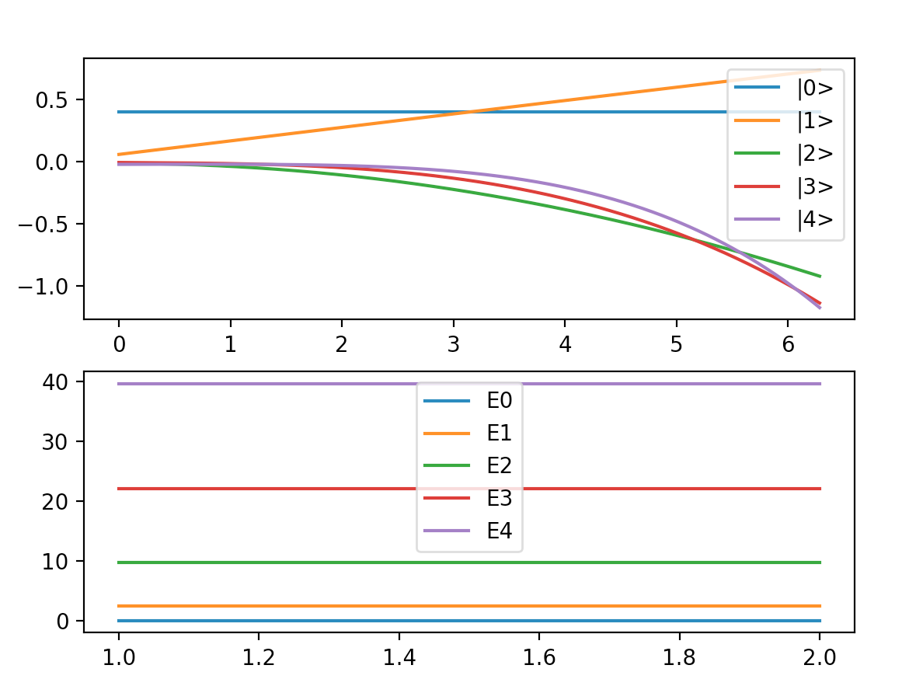

Program
# Solving TISE 

This package allows to solve approximately the Time Independent Schrodinger Equation. From the variational principle it is possible to arrive to a set of algebraic linear equations, which solutions provides the best wave function given the size of the chosen basis.

## Getting started


### Prerequisites
For using this package you would need to install python 3. You can download it from https://www.python.org/downloads/

### Installing

For installing the dynamic package you have to do the following
- Go to the folder *TISE_Project*
- Once inside, type the following command through the terminal
```sh
$ pip3.6 install --user .
```

### Input data from console

The input file that should has the following parameters:

######  Type of basis function used 
You can chose between Legendre Polynomials (LP) or Fourier series (FS). Type on the terminal 0 (zero) for LP otherwise you will use FS.
######  Size of the basis
######  Potential operator (constant value)


##### Example of input
Once installed, you create a input file as follows 
```sh
 Type of basis: LP(0) or Fourier (1)
1
 Size of basis
5
 Number of grid points
1000
 Potential (constant)
0
```
In this particular case the TISE is going to be solve by employing a Fourier series as basis set with a size of 5, using 1000 grid point and the potential (V) is 0. 

After this you can execute the program as follows
```sh
TISE yourPath/Input.txt
```

# Running the tests
In order to perform the test cases done for building this package you have to:
- Go to the *TISE_Project* folder
- Install *pytest* using the following command
```sh
$ pip3.6 install pytest
```
- Then to check the test, please type
```sh
$ python3 -m pytest test/test.py
$ python3 -m pytest test/test.py --cov
```

## Test cases

#### Numerical First derivative

#### Numerical Second derivative

#### Numerical Integration

##### Normalization of a function

##### LP formulation


### Development

Want to contribute? Great!


**Free Software, Hell Yeah!**

[//]: # (These are reference links used in the body of this note and get stripped out when the markdown processor does its job. There is no need to format nicely because it shouldn't be seen. Thanks SO - http://stackoverflow.com/questions/4823468/store-comments-in-markdown-syntax)


[dill]: <https://github.com/joemccann/dillinger>
[git-repo-url]: <https://github.com/joemccann/dillinger.git>
[john gruber]: <http://daringfireball.net>
[df1]: <http://daringfireball.net/projects/markdown/>
[markdown-it]: <https://github.com/markdown-it/markdown-it>
[Ace Editor]: <http://ace.ajax.org>
[node.js]: <http://nodejs.org>
[Twitter Bootstrap]: <http://twitter.github.com/bootstrap/>
[jQuery]: <http://jquery.com>
[@tjholowaychuk]: <http://twitter.com/tjholowaychuk>
[express]: <http://expressjs.com>
[AngularJS]: <http://angularjs.org>
[Gulp]: <http://gulpjs.com>

[PlDb]: <https://github.com/joemccann/dillinger/tree/master/plugins/dropbox/README.md>
[PlGh]: <https://github.com/joemccann/dillinger/tree/master/plugins/github/README.md>
[PlGd]: <https://github.com/joemccann/dillinger/tree/master/plugins/googledrive/README.md>
[PlOd]: <https://github.com/joemccann/dillinger/tree/master/plugins/onedrive/README.md>
[PlMe]: <https://github.com/joemccann/dillinger/tree/master/plugins/medium/README.md>
[PlGa]: <https://github.com/RahulHP/dillinger/blob/master/plugins/googleanalytics/README.md>


